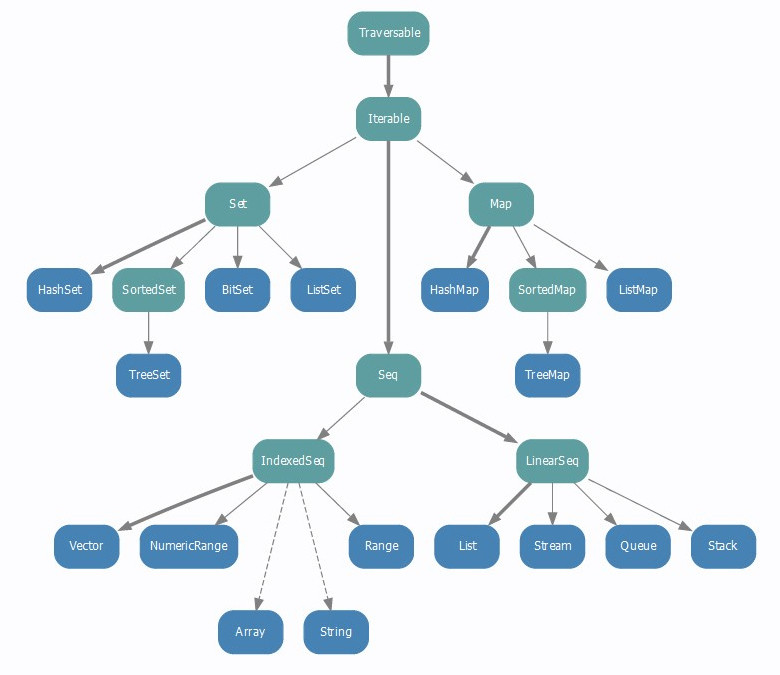

# Scala

**见划出下划线的几组即可。**

## 1.定义函数

**<u>def 函数名\[类型参数](参数名：参数类型):返回值类型 = {}</u>**
将类型参数放置在名称之后，以方括号括起来，J理解为指示哪个代表参数。`def 函数名[U](参数):返回值 = {}`

隐式参数，可以申明一个参数为隐式（implicit）,不需要显式的传递，系统将从作用域中找到一个被标示为implicit变量，如果找不到implicit变量，编译的时候将会报错。


## 2.Scala类型
**<u>scala中有数组Array和集合List，Tuple圆括号，Set，Map</u>**

```scala
scala> Seq(1, 1, 2)
res3: Seq[Int] = List(1, 1, 2)
```

```scala
var z = Array("Runoob", "Baidu", "Google")
val mainList = List(3, 2, 1)//只能同一类元素
val t = (1, 3.14, "Fred")  //J Tuple可以不用关键字定义，只用圆括号，最多支持22个元素，可以包含不同类型的元素
val set = Set(1,2,3) //元素不能重复
val colors = Map("red" -> "#FF0000", "azure" -> "#F0FFFF") //scala中的Map类似python的字典
```

`WrappedArray` wraps an `Array` to give it extra functionality.  

This allows an array to be wrapped so it can be used in places where some generic collection type like `Seq` is required. 

**在Scala中，数组Array是一种特殊的collection。数组可以隐式转换为WrappedArray，其为Seq的子类。反之可以使用Traversable提供的toArray方法将WrappedArray转换为数组。** 

<u>J即wrappedarray作为数组转换为序列时使用。</u>

```scala
scala> val a1 = Array(1, 2, 3)
a1: Array[Int] = Array(1, 2, 3)

scala> val seq: Seq[Int] = a1
seq: Seq[Int] = WrappedArray(1, 2, 3)
```


## 3.map函数：dataframe中不常用

// def map\[U\](f: (T) ⇒ U)(implicit arg0: ClassTag[U]): RDD[U]

**<u>将类型参数放置在名称之后，以方括号括起来，J理解为指示哪个代表参数。</u><u>def 函数名[U] (参数):返回值 = {}</u>**

<u>在scala返回的结果中包含的list[int]则表示，如下例子：The type of a list that has elements of type T is written as List[T]</u>
```scala
//即返回的类型，比如上面的RDD[U]
scala> val nums: List[Int] = List(1, 2, 3, 4)
nums: List[Int] = List(1, 2, 3, 4)
```

**参数名是f，这是一个匿名函数，参数类型定义了从T到U的匿名函数，T表示源数据类型，U表示目标数据类型，其中圆括号可以去除，因为只有一个参数**

**<u>这里表明类或方法在定义时没有给定具体参数类型，需要在编译或运行时自动推断出类型的一种方法。</u>**

**<u>map常用两种操作，一种简单写（常用于元素是tuple或是pair rdd中，因为用\_1或\_2来访问），一种展开写。</u>**

val numUsers = ratings.map(\_.\_2.user).distinct.count //常用于元素是tuple或是pair rdd中，因为用_1或\_2来访问。

```scala
val movies = sc.textFile("oss://milano/input/movies.dat").map { line =>
      val fields = line.split("::")
      // format: (movieId, movieName)
      (fields(0).toInt, fields(1))
    }.collect
```


## 4.reduce函数

 **reducebykey(\_+\_)返回也是pairrdd**

```linux
// rdd的reduce二元操作，可以从scala的reduce得到启发：
scala> val list = List(1,2,3,4,5)
list: List[Int] = List(1, 2, 3, 4, 5)
scala> list.reduce(_ - _)
res29: Int = -13 //可以看出，得到的结果和reduceLeft的结果是一样的
// 1-2 = -1
// -1-3 = -4
// -4-4 = -8
// -8-5 = -13
```

##5.Option[T]
**Option[T] 是一个类型为 T 的可选值的容器。「我会想办法回传一个T，但也可能没有T给你」。**
 **如果值存在， Option[T] 就是一个 Some[T] ，要取Some中的值需要用get方法，如果不存在， Option[T] 就是对象 None 。**

如果Option[T]中是一般的数据类型，那就用get取，**但如果是Option[Any]，使用模式匹配，见下面例子，因为Any没有get方法，因为这是函数中定义了Any类型，所以必须要进一步匹配才能提取值**

```scala
println(request.getParameter("content"))//{"id":1,"name":"OZKA","birthDate":"1981-02-08T20:00:00.000Z","monthRevenue":1000.75,"developer":true}
val result = scala.util.parsing.json.JSON.parseFull(request.getParameter("content"))  
result match {
  case Some(e:Map[String,String]) => {
    println(e); //output: Map(name -> OZKA, monthRevenue -> 1000.75, developer -> true, birthDate -> 1981-02-08T20:00:00.000Z, id -> 1.0)
    e.foreach { pair =>
        println(pair._1 + ":" + pair._2)        
    }
  }
  case None => println("Failed.")
}
```

Option类型的值通常作为Scala集合类型（List,Map等）操作的返回类型。比如Map的get方法： 

```scala
scala> val capitals = Map("France"->"Paris", "Japan"->"Tokyo", "China"->"Beijing")
capitals: scala.collection.immutable.Map[String,String] = Map(France -> Paris, Japan -> Tokyo, China -> Beijing)

scala> capitals get "France"
res0: Option[String] = Some(Paris)

scala> capitals get "North Pole"
res1: Option[String] = None


scala> capitals get "North Pole" get
warning: there was one feature warning; re-run with -feature for details
java.util.NoSuchElementException: None.get
  at scala.None$.get(Option.scala:347)
  at scala.None$.get(Option.scala:345)
  ... 33 elided

scala> capitals get "France" get
warning: there was one feature warning; re-run with -feature for details
res3: String = Paris

scala> (capitals get "North Pole") getOrElse "Oops"
res7: String = Oops

scala> capitals get "France" getOrElse "Oops"
res8: String = Paris
```

Option有两个子类别，Some和None。当程序回传Some的时候，代表这个函式成功地给了你一个String，而你可以透过get()函数拿到那个String，如果程序返回的是None，则代表没有字符串可以给你。 
在返回None，也就是没有String给你的时候，如果你还硬要调用get()来取得 String 的话，Scala一样是会抛出一个NoSuchElementException异常给你的。 

我们也可以选用另外一个方法，getOrElse。这个方法在这个Option是Some的实例时返回对应的值，而在是None的实例时返回传入的参数。换句话说，传入getOrElse的参数实际上是默认返回值。

**<u>[T]实际上用于许多不指定类型的函数中，来表示哪个是类型参数</u>**

```scala
val x = 5
def f[T](v: T) = v
f(x) // T is Int, the type of x
```

##6.新建变量var和常量val

```scala
var passengerset = Set[Int]()
passengerset.add(passenger)
```

##7.统计wordcount

```scala
wordListRDD.map((_,1)).reducebykey(_+_)
```

## 8.用override val 覆盖父类或trait中不带参数的def。

```scala
class Father{
    def name = "Archer"
    def score() = 1.0
    val id = 12
}

class Children extends Father{
    override val name = "Jack" 
    override val score  = 2.0
    override def id = 10  //  error: error overriding value id in class Father of type Int; method id is not stable
}		
```

## 9.zip函数
**zip函数用于将两个RDD组合成(a,b)元祖形式的RDD.**

这里默认两个RDD的partition数量以及元素数量都相同，否则会抛出异常。元祖tuple的访问方式是.\_1
`val predictionAndLabel = prediction.zip(examples.map(_.label))`

##10.匿名函数两种写法

<u>**匿名函数可以用在map中，一定要有参数列表**：</u>

<u>**scala匿名函数语法很简单，箭头左边是参数列表（使用括号），右边是函数体。**</u>

<u>**另外一种构建匿名函数的方法，使用case函数（不用括号）："case [参数列表] => [函数体]"**</u>

```scala
scala> (x: Int) => x + 1
res6: Int => Int = <function1>

scala> List(1,2,3) map {case i:Int=>i+1}
res1: List[Int] = List(2, 3, 4)
```

## 11.trim函数用于去除空格等

```scala
scala> var a = "mysql  "
a: String = "mysql  "
scala> a.trim()
res14: String = mysql
```

## **12.类和对象，class和object**

### main函数必须定义在object中，可以在main函数中使用 new 来实例化类，并访问类中的方法和变量。
<u>**在scala中，main函数必须定义在object中**。</u><u>可以在main函数中使用 new 来实例化类，并访问类中的方法和变量</u>。

**单例模式：涉及到一个单一的类，该类负责创建自己的对象，同时确保只有单个对象被创建。**
```scala
//burst.scala文件中
object Burst {
  def main(args: Array[String]):Unit = {
    //具体代码
  }
```

### <u>单例模式（J即有伴生对象的情况），则是类似static：直接可以调用，不用声明</u>
**Scala 中使用单例模式时，除了定义的类之外，还要定义一个同名的 object 对象，它和类的区别是，<u>object对象不能带参数</u>**。**当单例对象与某个类共享同一个名称时，它就被称为是这个类的伴生对象(companion object)，你必须在同一个源文件里定义类和它的伴生对象，类和它的伴生对象可以互相访问其私有成员。**

**<u>不与伴生类共享名称的单例对象称为独立对象</u>。**

<u>object是单例对象，如果是有同名类，伴生对象；没有，独立对象。单例模式（J即是伴生对象的情况），则是类似static：直接可以调用，不用声明</u>

### 独立对象实例

```
import java.io._

class Point(val xc: Int, val yc: Int) {
   var x: Int = xc
   var y: Int = yc
   def move(dx: Int, dy: Int) {
      x = x + dx
      y = y + dy
   }
}

object Test {
   def main(args: Array[String]) {
      val point = new Point(10, 20)
      printPoint

      def printPoint{
         println ("x 的坐标点 : " + point.x);
         println ("y 的坐标点 : " + point.y);
      }
   }
}
```

执行以上代码，输出结果为：

```
$ scalac Test.scala 
$ scala Test
x 的坐标点 : 10
y 的坐标点 : 20
```

### 伴生对象实例

```
/* 文件名：Marker.scala
 * author:菜鸟教程
 * url:www.runoob.com
 */

// 私有构造方法
class Marker private(val color:String) {

  println("创建" + this)
  
  override def toString(): String = "颜色标记："+ color
  
}

// 伴生对象，与类共享名字，可以访问类的私有属性和方法
object Marker{
  
    private val markers: Map[String, Marker] = Map(
      "red" -> new Marker("red"),
      "blue" -> new Marker("blue"),
      "green" -> new Marker("green")
    )
    
    def apply(color:String) = {
      if(markers.contains(color)) markers(color) else null
    }
  
    
    def getMarker(color:String) = { 
      if(markers.contains(color)) markers(color) else null
    }
    def main(args: Array[String]) { 
        println(Marker("red"))  
        // 单例函数调用，省略了.(点)符号  
        println(Marker getMarker "blue")  
    }
}
```

执行以上代码，输出结果为：

```
$ scalac Marker.scala 
$ scala Marker
创建颜色标记：red
创建颜色标记：blue
创建颜色标记：green
颜色标记：red
颜色标记：blue
```

## 13.特征trait
**一个 Traits 封装了方法和变量，和 Interface 相比，它的方法可以有实现，这一点有点和抽象类定义类似。**

<u>一但定义好 Trait，它就可以用来和一个类混合，这可以使用 extends 或 with 来混合一个 trait。</u>

```scala
class Frog extends Philosophical{
  override def toString="gree"
}
```

<u>如果你需要把某个 Trait 添加到一个有基类的子类中，使用 extends 继承基类，而可以通过 with 添加 Trait。</u>

```scala
class Animal
class Frog extends Animal with Philosophical{
  override def toString="green"
}
```

java中接口的意义：
我写接口你实现，接口不就用上了。我不给你规定好了，你怎么知道该实现哪些内容呢。更进一步，我写接口你实现，你今天不在，我明天出差，程序后天交工，那我今天必须把调用这个接口的代码写好。所以就需要接口中有函数，有明确的函数签名。我写个接口，再把调用函数写好，明天你把接口实现了，传个实例进来，交工。

```java
public interface aWriteInterface{
public void func();
}

//A调用里边的功能func
aWriteInterface awrite;
awrite = xxx
awrite.func()

//第二天然后B实现接口
public class B implements aWriteInterface {
public void func() {
System.out.println("B已经实现");
}
}

//然后B将上边的awrite = xxx改为 awrite = new B();

```


## 14.SEQ序列

**特性（trait) Seq 具有两个子特征（subtrait） LinearSeq和IndexedSeq。常用线性序列有 `scala.collection.immutable.List`和`scala.collection.immutable.Stream`。常用索引序列有 `scala.Array scala.collection.mutable.ArrayBuffer`。**

因为Seq是一个trait，类似接口，而接口需要有实现，而List is the default implementation of LinearSeq, which in turn is the default implementation of Seq。

因此List是它的一个实现类，调用Seq会创建一个List。

Seq对象是一个工厂对象，工厂方法模式将对实际类的初始化封装在一个方法中，让子类来决定初始化哪个类。
下面有张图解释了几个type间的关系。


##<u>15.Scala中没有删除项</u>

Unfortunately, you cannot delete a specific variable in Scala REPL.[1] What you can do is assigning a new value to override an existing variable. Scala REPL also provides a command <u>`:reset` to remove all variables.</u>

```scala
scala> :reset
Resetting interpreter state.
Forgetting this session history:
val a = 3
val b = 5
Forgetting all expression results and named terms: $intp, a, b
```

## 16.Scala中需要用三个引号来引用多行语句。

Multiline strings in Scala have to be enclosed using triple quotes:

```
hiveContext.sql("""
    select linestatus, sum(quantity) as sum_qty,count(*) as count_order 
    from lineitem
    where shipdate <= '1990-09-16' group by linestatus order by linestatus""")
```

## <u>17.由getClass知道变量和常量类型</u>

```scala
val x = 5
x.getClass.getSimpleName // int -- technically, an Int cannot be a class, but Scala fakes it
//https://stackoverflow.com/questions/19386964/i-want-to-get-the-type-of-a-variable-at-runtime
```


## References

- [Scala 类和对象](http://www.runoob.com/scala/scala-classes-objects.html)